<!-- README.md is generated from README.Rmd. Please edit that file -->

# allespaletti

<!-- badges: start -->

<!-- badges: end -->

`allespaletti` contains various color palettes I find useful,
particularly for communication research. This includes palettes for:

  - beautiful plots both color-blind- and printer-friendly
  - political parties
  - social networking sites
  - communication associations

## Installation

Install from [GitHub](https://github.com/) with:

``` r
# install.packages("remotes")
remotes::install_github("joon-e/allespaletti")
```

## Use

Load the package:

``` r
library(allespaletti)
```

Palettes can then be added to `ggplot2` objects using custom
`scale_fill_xxx` / `scale_color_xxx` functions. See below for all
available palettes:

``` r
library(ggplot2)
diamonds %>% 
  ggplot(aes(x = cut, fill = cut)) +
  geom_bar() + 
  scale_fill_tol("vibrant")
```

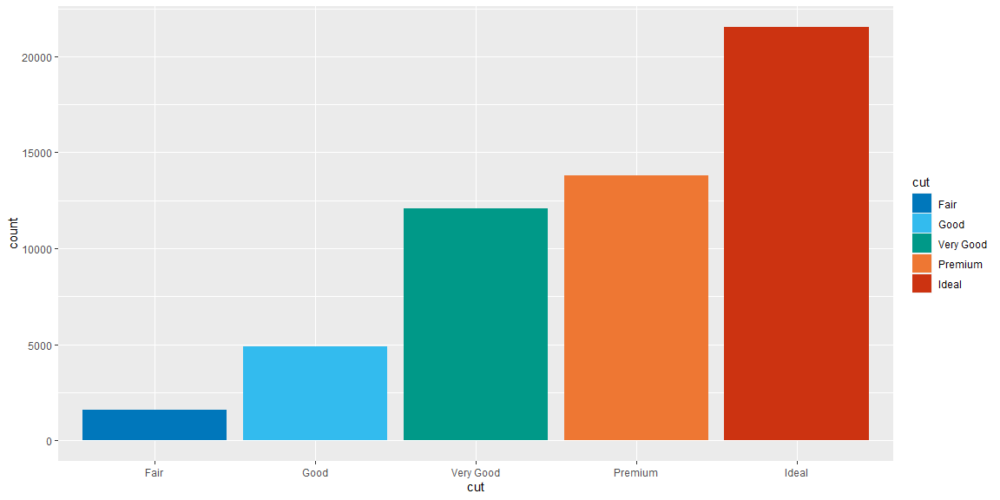

Use `reverse = TRUE` to plot colors in reverse order or pass a vector of
color names (see below) to `select` to create a custom order (useful for
palettes with *meaningful* colors like political party or sns colors):

``` r
ggplot(sns_users_april_2020, aes(x = sns, y = users, fill = sns)) +
  geom_col() +
  scale_fill_sns(select = c("facebook", "youtube", "whatsapp", "instagram")) +
  labs(x = NULL, y = "Users (in millions)") +
  theme(legend.position = "none")
```


## Palettes

Plot title shows the palette name that can be passed to the respective
`scale_fill_` / `scale_color_` function; printed color names can be used
for the `select` argument.

### Paul Tol’s color schemes

[Paul Tol](https://personal.sron.nl/~pault/) developed various
qualitative, sequential, and divergent color schemes that are both
beautiful and distinct for most people (e.g., various forms of
color-blindness) and situations (screen, print-out, black and white
copy).

The following palettes are available for `scale_fill_tol()` /
`scale_color_tol()`:

#### Qualitative palettes

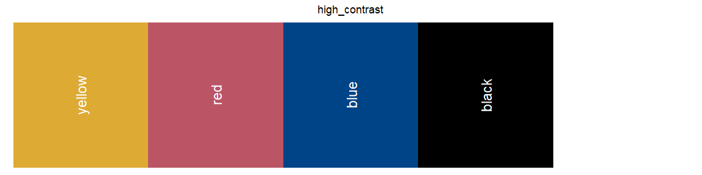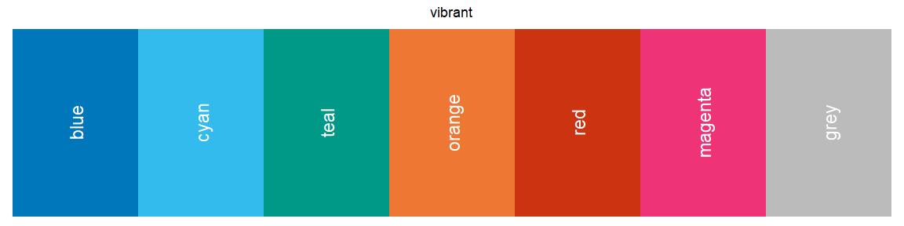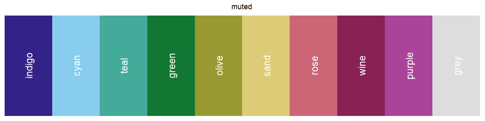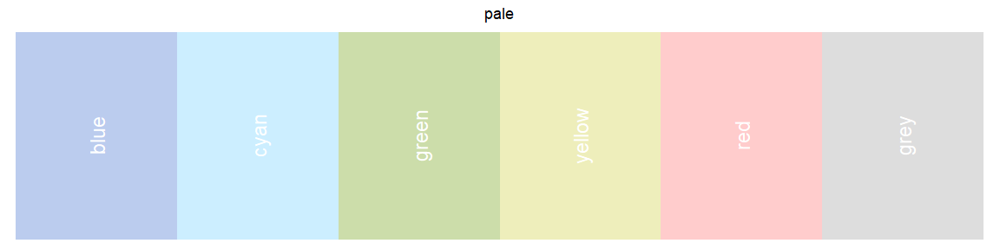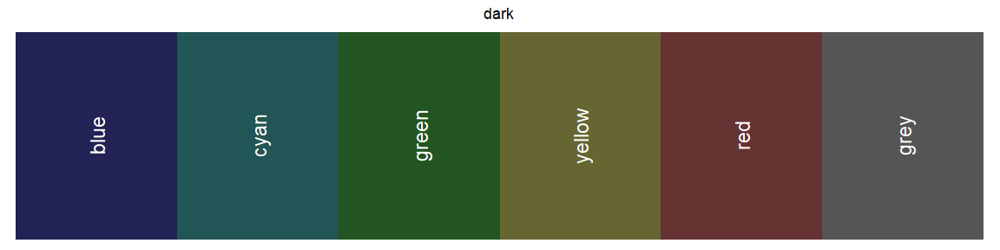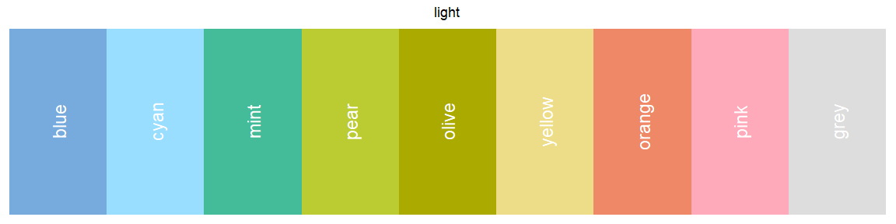

#### Diverging palettes

Use `discrete = FALSE` in the call to `scale_fill_tol()` /
`scale_color_tol()` to use these scales for continuous data.


#### Sequential palettes

Use `discrete = FALSE` in the call to `scale_fill_tol()` /
`scale_color_tol()` to use these scales for continuous data.

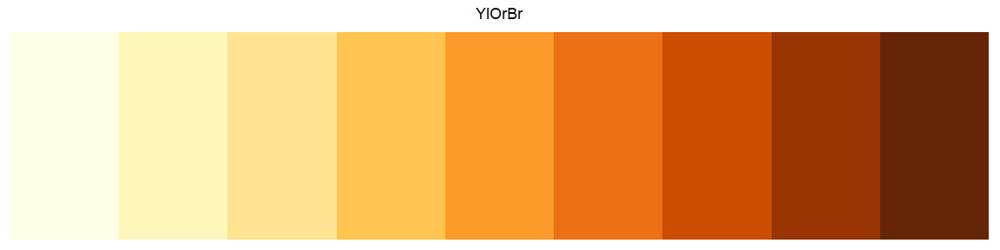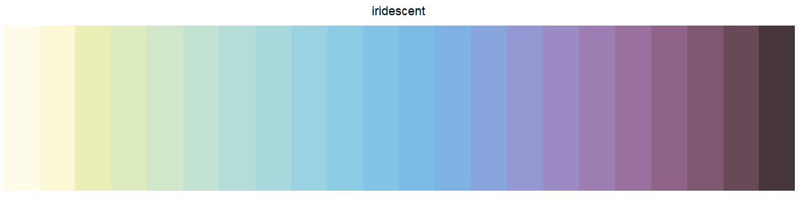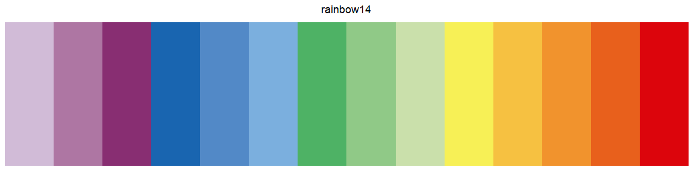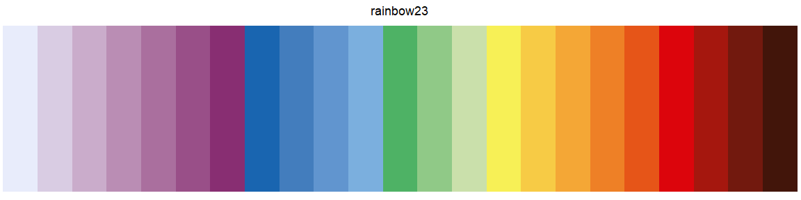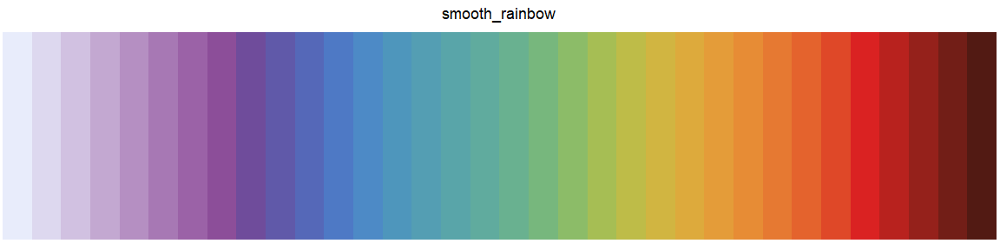

### Politics

Palettes containing colors of political parties.

The following palettes are available for `scale_fill_politics()` /
`scale_color_politics()`:

#### German parties

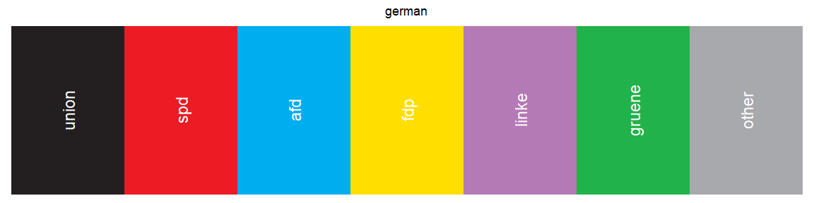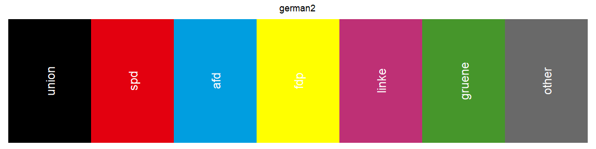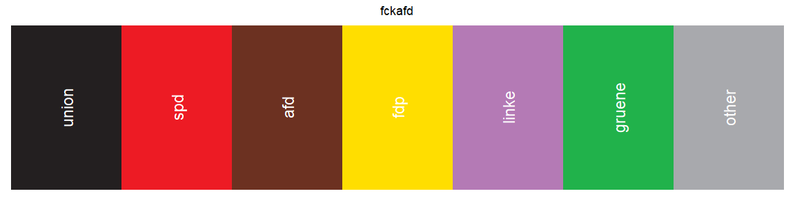

#### US parties

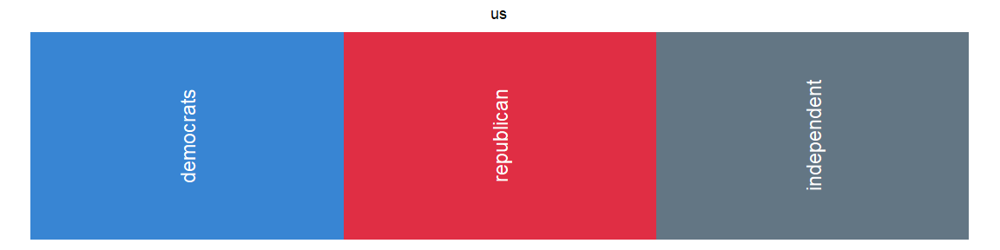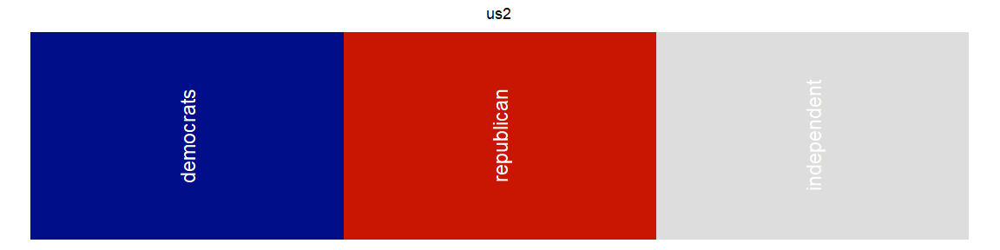

### Social networking sites

Palettes containing colors of social networking sites.

The following palettes are available for `scale_fill_sns()` /
`scale_color_sns()`:

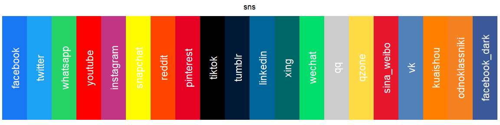

### Communication associations

Palettes containing colors of communication associations.

The following palettes are available for `scale_fill_comm()` /
`scale_color_comm()`:

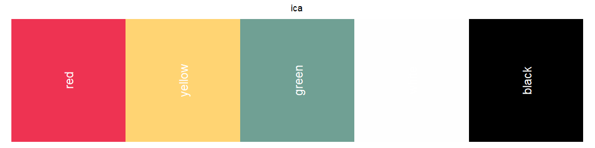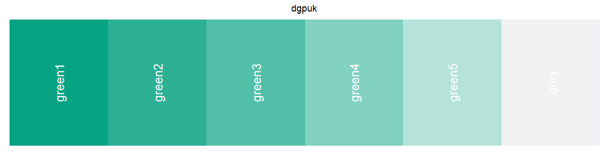
